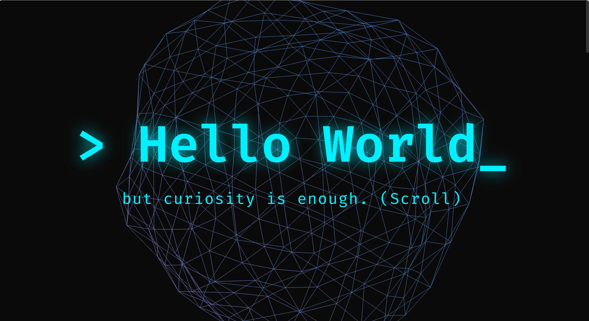
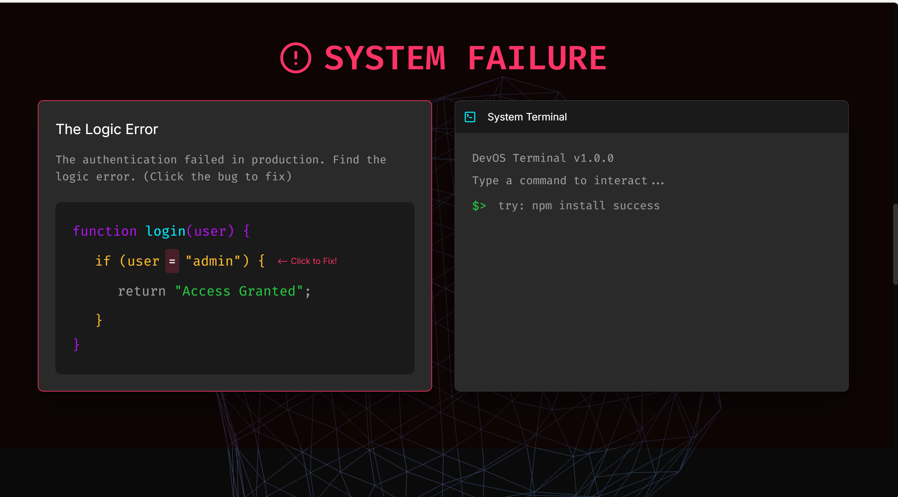
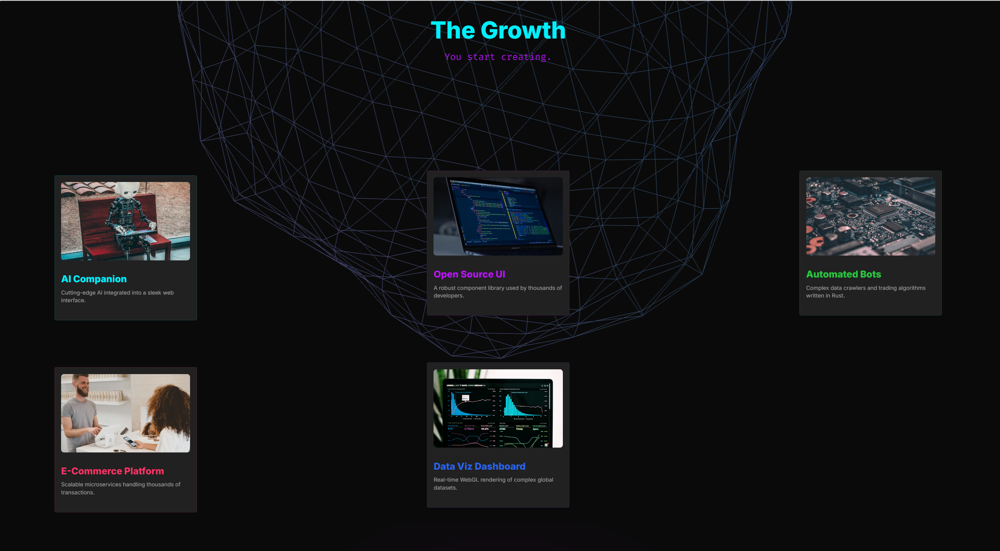

# 🧑‍💻 The Life of a Developer


> *An Awwwards-level interactive storytelling web experience that narrates the emotional and technical journey of a developer — from their first "Hello World" to becoming a builder.*

---

## ⚡ At a Glance

- 🎬 Interactive storytelling experience (not a static site)
- 🎮 Includes playable bug-fix challenge & terminal
- 🌊 Scroll-driven animations (GSAP + Lenis)
- 🧱 Built with React, MUI, Framer Motion, Three.js
- 🏆 Designed for immersive, Awwwards-style UX

---

## ✨ Live Demo

🔗 [Experience the Story Live](https://dev-life-eight.vercel.app/)

---

## 📸 Preview






---

## 📖 Project Description

"The Life of a Developer" is an immersive interactive storytelling experience that transforms the journey of learning programming into a cinematic narrative. Instead of presenting information through static sections, the project allows users to actively participate in the story — typing their first line of code, unlocking skills, fixing real bugs, and building projects.

The experience is structured into five distinct phases, each representing a stage in a developer's growth. From the curiosity of writing "Hello World" to the frustration of debugging and the satisfaction of building real-world projects, every section is designed to evoke emotion and engagement.

Advanced animation techniques using GSAP and Framer Motion are combined with smooth scrolling via Lenis to create a seamless, high-performance experience. Interactive elements such as a bug-fixing mini game, draggable project cards, and a simulated terminal enhance user involvement and reinforce the narrative.

The project emphasizes storytelling, interactivity, and performance — aiming to make users **feel** the journey of becoming a developer, rather than simply reading about it.

---

## 🔄 User Journey

1. 👨‍💻 Type your first line of code
2. 📚 Unlock core web technologies
3. 🐛 Face and fix real debugging errors
4. 🚀 Build and explore real projects
5. 🏆 Achieve developer status

---

## 💡 What Makes This Unique

- 🎭 **Not a website — a playable story** — users actively unlock each scene through interaction
- 🧠 **Combines emotion + interaction + animation** — every phase has a distinct mood and mechanic
- 🐛 **Includes a real debugging challenge** — not just visuals, but an actual logic-error fix
- 🏆 **Designed with Awwwards-level inspiration** — dark neon, glassmorphism, 3D, and fluid motion

---

## 🏆 How It Meets the Challenge Criteria

| Criterion | Weight | Implementation |
|-----------|--------|---------------|
| **Creativity & Storytelling** | 30% | A cinematic narrative structured across 5 emotional phases — curiosity, excitement, struggle, growth, and transformation |
| **Visual Design** | 25% | Dark neon aesthetic with glassmorphism, fluid typography, and immersive 3D elements |
| **Animation & Interactivity** | 20% | Scroll-driven GSAP timelines, Framer Motion interactions, drag mechanics, and a playable bug-fix challenge |
| **Responsiveness** | 15% | Fully optimized layouts for mobile, tablet, and desktop with adaptive animations |
| **Code Quality** | 10% | Modular architecture with reusable components, context-based state management, and scalable design patterns |

---

## 🎬 Story Structure

The experience is divided into **5 cinematic scenes**, each unlocked through interaction:

| Scene | Title | Interaction |
|-------|-------|-------------|
| 1 | **The Beginning** | Type `console.log("Hello World")` to unlock the journey |
| 2 | **The Excitement** | Click HTML → CSS → JS to progress your skills |
| 3 | **The Reality Hit** | Find and fix the logic bug `if (user = "admin")` |
| 4 | **The Growth** | Drag & explore 5 interactive project cards |
| 5 | **The Transformation** | Cinematic finale — *"Welcome to the world of builders."* |

---

## 🎮 Features

- **Immersive Narrative** — Every section unfolds a slice of a developer's real journey
- **Interactive 3D Background** — A scroll-linked wireframe icosahedron built with Three.js
- **Draggable Project Cards** — Framer Motion physics-based drag on all project cards
- **Ambient Soundtrack** — Background music with zero UI distractions
- **Glitch & Chaos Effects** — Red-tinted Debugging section with a live logic error to fix
- **Interactive Terminal** — Type dev-humour commands in the terminal
- **Cinematic Finale** — Staggered text reveals + stats board + "Start Again" button
- **Fully Responsive** — Fluid typography and stacked layouts for all screen sizes

---

## 🎯 Key Interactive Moments

- ✍️ Type your first line of code to begin the journey
- 🧩 Progress through a skill unlock system
- 🐛 Fix a real bug in a live debugging challenge
- 💻 Interact with a simulated developer terminal
- 🧱 Drag and explore project cards dynamically

---

## 🎨 Design Decisions

- **Dark theme** to reflect real developer environments and reduce cognitive load
- **Neon accents** (Cyan `#00f0ff` + Purple `#bc13fe`) to highlight interactivity and focus
- **Monospace typography** (`Fira Code`) to maintain a consistent coding aesthetic throughout
- **Section-wise mood transitions** — calm beginning → chaotic debugging → triumphant finale

---

## ⚔️ Challenges Faced

- Synchronizing GSAP scroll animations with smooth scrolling (Lenis) without conflicts
- Maintaining 60fps performance with Three.js 3D canvas and multiple Framer Motion animations running simultaneously
- Designing interactions that are meaningful and story-driven, not gimmicky
- Ensuring full responsiveness across all devices without breaking scroll-linked animations

---

## ⚡ Performance Optimization

- GSAP lag smoothing for consistent animation timing
- Lenis-powered smooth scrolling for fluid experience
- Optimized Three.js rendering to minimize GPU load
- Efficient component structure to prevent unnecessary re-renders

---

## 🔮 Future Improvements

- Add voice narration for a fully immersive storytelling experience
- Enhance 3D interactions with user-controlled camera movement
- Introduce branching story paths based on user choices
- Add more mini-games for deeper engagement at each phase

---

## 🎤 Presentation Tip

> For the **best experience**:
> - Use headphones 🎧 — ambient music enhances immersion significantly
> - Scroll slowly to follow the narrative as it unfolds
> - Interact with each section to unlock the next part of the journey

---

## 🛠️ Tech Stack

| Technology | Purpose |
|------------|---------|
| **React + Vite** | Core framework (JavaScript / JSX) |
| **Material UI (MUI)** | Theming, layout, responsive components |
| **Framer Motion** | Component animations, drag mechanics, layout transitions |
| **GSAP + ScrollTrigger** | Scroll-based storytelling timelines |
| **Lenis** | Ultra-smooth scroll inertia |
| **Three.js + React Three Fiber** | Interactive 3D background canvas |
| **React Three Drei** | 3D helpers (Float, MeshDistortMaterial) |
| **react-type-animation** | Typewriter narrative text |
| **lucide-react** | Icon set |

---

## 🚀 Getting Started

```bash
# Install dependencies
npm install

# Start development server
npm run dev

# Build for production
npm run build

# Preview production build
npm run preview
```

---

## 📁 Project Structure

```
src/
├── components/
│   ├── sections/
│   │   ├── HeroSection.jsx       # Scene 1 — Console lock interaction
│   │   ├── LearningPhase.jsx     # Scene 2 — Skill unlock progression
│   │   ├── DebuggingChaos.jsx    # Scene 3 — Bug fix + terminal
│   │   ├── ProjectsShowcase.jsx  # Scene 4 — Draggable project cards
│   │   └── FinaleSection.jsx     # Scene 5 — Cinematic conclusion
│   ├── ThreeBackground.jsx       # Fixed 3D animated canvas
│   └── MusicPlayer.jsx           # Invisible ambient audio player
├── context/
│   └── StoryContext.jsx          # Global narrative state
├── theme.js                      # MUI dark theme configuration
├── App.jsx                       # Root layout + Lenis scroll setup
└── main.jsx                      # Entry point
```

---

## 📦 Key Dependencies

```json
{
  "react": "^19",
  "@mui/material": "^6",
  "framer-motion": "^12",
  "gsap": "^3",
  "lenis": "^1",
  "three": "^0.175",
  "@react-three/fiber": "^9",
  "@react-three/drei": "^10",
  "react-type-animation": "^3",
  "lucide-react": "^0.483"
}
```

---

## 👨‍💻 Author

Built with ❤️, caffeine ☕, and countless debugging sessions by **Lucky Joshi**

---

> "You don't just learn to code…
> you become a developer."
